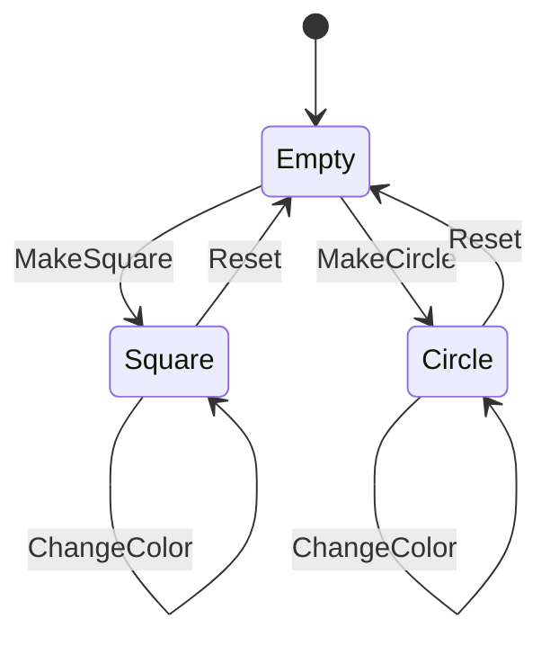

# state_management

Flutter project to illustrate some state management packages.

## [Live demo](https://glebosotov.github.io/flutter-education-state-management/)

## Links from my lecture on this topic

- [What is State (by flutter)](https://docs.flutter.dev/data-and-backend/state-mgmt/ephemeral-vs-app)
- [What is Finite State Automata](https://en.wikipedia.org/wiki/Finite-state_machine)
- [Contact me](https://t.me/glebosotov)

## FSM for state manager in this project

## List of state management approaches demostrated

- [bloc](https://pub.dev/packages/bloc)
- [riverpod](https://pub.dev/packages/riverpod)
- [elementary](https://pub.dev/packages/elementary)
- [getx](https://pub.dev/packages/get)
- [mobx](https://pub.dev/packages/mobx)
- [redux](https://pub.dev/packages/redux)
- [provider](https://pub.dev/packages/provider)
- setState
